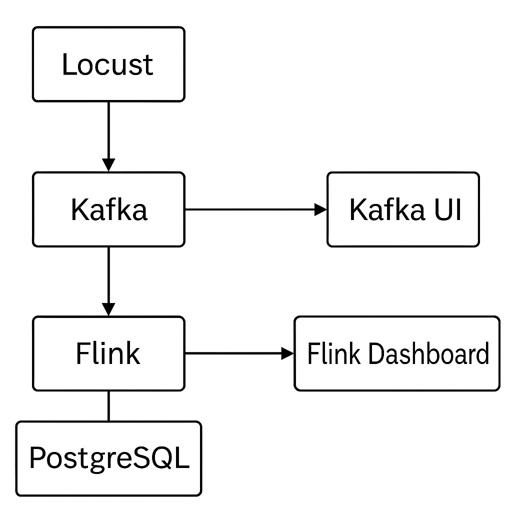

# ARQUITETURA DE SOFTWARE - 25.2

## Stream Processing com Apache Flink (SPAF)


### 1. O que vai ser feito?
Vamos construir um pipeline que processa dados de vendas simuladas em tempo real para gerar métricas e análises imediatas. Os eventos transitam por Kafka, são processados pelo Apache Flink, e os resultados ficam disponíveis para consulta e visualização.

### 2. Como vai ser feito?
- **Geração de dados**: Locust Script Python gera vendas fictícias (50 a 100 eventos por segundo).
- **Ingestão e transporte**: Os eventos vão para um tópico do Apache Kafka.
- **Processamento**: Apache Flink consome os dados, faz agregações (vendas por categoria, detecção de anomalias).
- **Armazenamento**: Resultados salvos em PostgreSQL.

### 3. Métricas a serem avaliadas
- Latência entre geração e visualização dos dados (end-to-end delay).
- Throughput do sistema (eventos processados por segundo).
- Consumo de recursos (CPU e memória) dos componentes principais (Kafka, Flink).
- Precisão e consistência das agregações e detecções feitas pelo Flink.

### 4. Análise e apresentação dos resultados
- Apresentar gráficos de latência e throughput em diferentes cargas (ex: 10, 50, 100 eventos/s).
- Apresentação sobre as ferramentas utilizadas no projeto.
- Discorrer sobre a arquitetura, possíveis falhas e melhorias futuras.

---

## 📌 Arquitetura



---

## ⚙️ Pré-requisitos

- **Docker** e **Docker Compose**  
- **Python 3.10+** com `venv` configurado  
- **Maven 3+** e **Java 11+**  

---

## 🐳 Subindo os serviços

Na raiz do projeto:

```bash
docker-compose up -d
```

Verifique se os containers estão rodando:

```bash
docker ps --format "table {{.Names}}	{{.Status}}"
```

Você deve ver algo como:
```
zookeeper   Up
kafka       Up
postgres    Up (healthy)
jobmanager  Up
taskmanager Up
kafka-ui    Up
```

---

## 📦 Criando o tópico no Kafka

```bash
docker exec -it kafka kafka-topics   --create   --topic vendas-simuladas   --bootstrap-server localhost:9092   --partitions 1 --replication-factor 1
```

Listar os tópicos:

```bash
docker exec -it kafka kafka-topics --list --bootstrap-server localhost:9092
```

---

## 📝 Gerando eventos com Locust

1. Ative o ambiente virtual:
   ```bash
   source venv/bin/activate
   ```

2. Instale o Locust (se ainda não fez):
   ```bash
   pip install locust
   ```

3. Rode o script:
   ```bash
   locust -f locust/sales_generator.py
   ```

4. Acesse a UI do Locust:  
   👉 [http://localhost:8089](http://localhost:8089)

   Configure:
   - Usuários: `100`  
   - Taxa de spawn: `50`  
   - Host: `http://localhost:9092`  

---

## ⚡ Rodando o Job no Flink

Compile e gere o **JAR empacotado**:

```bash
mvn clean package -DskipTests
```

Copie o JAR para o JobManager:

```bash
docker cp target/spaf-1.0-SNAPSHOT-shaded.jar jobmanager:/opt/flink/
```

Execute o job:

```bash
docker exec -it jobmanager flink run   -c com.example.spaf.SalesJob   /opt/flink/spaf-1.0-SNAPSHOT-shaded.jar
```

---

## 🗄️ Consultando no PostgreSQL

Acesse o banco:

```bash
docker exec -it postgres psql -U postgres -d postgres
```

Veja os dados processados:

```sql
SELECT * FROM sales_summary ORDER BY created_at DESC LIMIT 10;
```

---

## 📊 Dashboards

- **Kafka UI** → [http://localhost:8080](http://localhost:8080)  
- **Locust** → [http://localhost:8089](http://localhost:8089)  
- **Flink Dashboard** → [http://localhost:8081](http://localhost:8081)  

---
